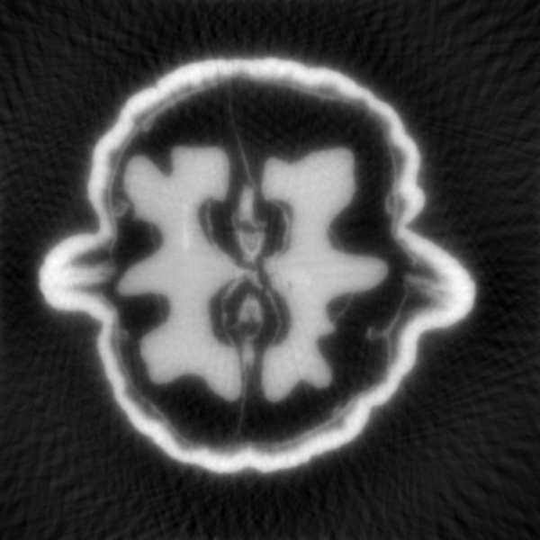
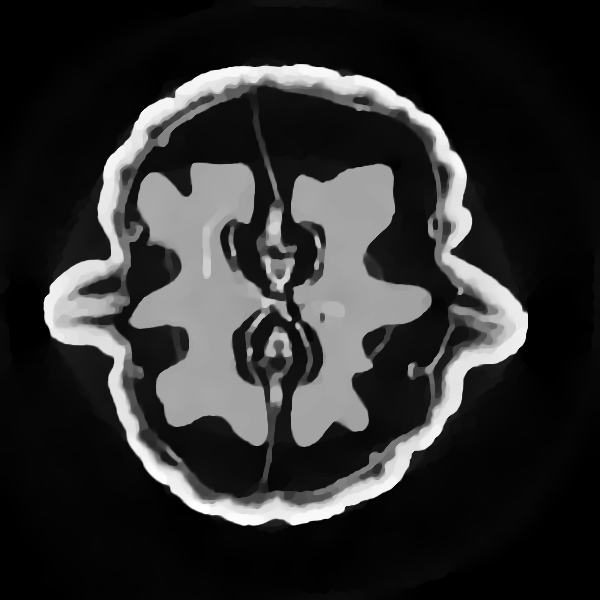

# Gratopy
[](https://doi.org/10.5281/zenodo.5221442)
[](https://gratopy.readthedocs.io/?badge=latest)

The gratopy (**Gr**az **a**ccelerated **to**mographic projections for **Py**thon) toolbox is a Python3 software package for the efficient and high-quality computation of Radon transforms, fanbeam transforms as well as the associated backprojections. The included operators are based on pixel-driven projection methods which were shown to possess [favorable approximation properties](https://epubs.siam.org/doi/abs/10.1137/20M1326635). The toolbox offers a powerful parallel OpenCL/GPU implementation which admits high execution speed and allows for seamless integration into [PyOpenCL](https://documen.tician.de/pyopencl/). Gratopy can efficiently be combined with other PyOpenCL code and is well-suited for the development of iterative tomographic reconstruction approaches, in particular, for those involving optimization algorithms.

## Highlights
* Easy-to-use tomographic projection toolbox.
* High-quality 2D projection operators.
* Fast projection due to custom OpenCL/GPU implementation.
* Seamless integration into PyOpenCL.
* Basic iterative reconstruction schemes included (Landweber, CG, total variation).
* Comprehensive documentation, tests and example code.

*The fanbeam projection of a walnut and gratopy’s Landweber and total variation reconstructions (from left to right).*
<table>
  <tr>
    <td width="20%" align="center"></td>
    <td width="40%" align="center"></td>
    <td width="40%" align="center"></td>
  </tr>
 </table>

## Installation

The toolbox can easily be installed using pip:

```bash
pip install gratopy
```

Alternatively, a release or snapshot archive file can directly be downloaded and unpacked.
Calling 

```bash
pip install .
```

inside the main folder then installs the toolbox. 
Gratopy supports setuptools for installation such that 

```bash
python setup.py install
```

has the same effect.
For more details we refer to the [documentation](https://gratopy.readthedocs.io/).

As a further alternative, if no dedicated installation is needed for the toolbox, the code can simply be downloaded and the contents of the `gratopy` directory can be imported as a module. Please make sure to have the following Python modules installed, most of which should be standard.

## Requirements

* [pyopencl>=2019.1](https://pypi.org/project/pyopencl/)
* [numpy>=1.17.0](https://pypi.org/project/numpy/)
* [scipy>=1.3.0](https://pypi.org/project/scipy/)
* [matplotlib>=3.2.0](https://pypi.org/project/matplotlib/)
* [Pillow>=6.0.0](https://pypi.org/project/Pillow/)
* [Mako>=1.1.0](https://pypi.org/project/Mako/)

Note that in particular, correctly installing and configuring PyOpenCL might take some time, as dependent on the used platform/GPU, suitable drivers must be installed. We refer to [PyOpenCL's documentation](https://documen.tician.de/pyopencl/).


## Getting started
We refer to the extensive [documentation](https://gratopy.readthedocs.io/), in particular to the [getting started](https://gratopy.readthedocs.io/en/latest/getting_started.html) guide, as well as to the test files for the [Radon transform](https://gratopy.readthedocs.io/en/latest/_modules/test_radon.html) and [fanbeam transform](https://gratopy.readthedocs.io/en/latest/_modules/test_fanbeam.html). The following [rudimentary example](https://gratopy.readthedocs.io/en/latest/getting_started.html#first-example-radon-transform) is also included in the documentation.

```python

# initial import
import numpy as np
import pyopencl as cl
import matplotlib.pyplot as plt

import gratopy

# discretization parameters
number_angles = 60
number_detectors = 300
Nx = 300
# Alternatively to number_angles one could give as angle input
# angles = np.linspace(0, np.pi, number_angles+1)[:-1]

# create pyopencl context
ctx = cl.create_some_context()
queue = cl.CommandQueue(ctx)

# create phantom as test image (a pyopencl.array.Array of dimensions (Nx, Nx))
phantom = gratopy.phantom(queue,Nx)

# create suitable projectionsettings
PS = gratopy.ProjectionSettings(queue, gratopy.RADON, phantom.shape,
                                number_angles, number_detectors)

# compute forward projection and backprojection of created sinogram
# results are pyopencl arrays
sino = gratopy.forwardprojection(phantom, PS)
backproj = gratopy.backprojection(sino, PS)

# plot results
plt.figure()
plt.title("Generated Phantom")
plt.imshow(phantom.get(), cmap="gray")

plt.figure()
plt.title("Sinogram")
plt.imshow(sino.get(), cmap="gray")

plt.figure()
plt.title("Backprojection")
plt.imshow(backproj.get(), cmap="gray")
plt.show()
```

## Authors

* **Kristian Bredies**, University of Graz, kristian.bredies@uni-graz.at
* **Richard Huber**, University of Graz, richard.huber@uni-graz.at

All authors are affiliated with the [Institute of Mathematics and Scientific Computing](https://mathematik.uni-graz.at/en) at the [University of Graz](https://www.uni-graz.at/en).

## Publications
If you find this tool useful, please cite the following associated publication.

* Kristian Bredies and Richard Huber. (2021). *Convergence analysis of pixel-driven Radon and fanbeam transforms.* SIAM Journal on Numerical Analysis 59(3), 1399–1432. https://doi.org/10.1137/20M1326635.
* Kristian Bredies and Richard Huber. (2021). *Gratopy 0.1* [Software]. Zenodo. https://doi.org/10.5281/zenodo.5221442

## Acknowledgements

The development of this software was supported by the following projects:

* *Regularization Graphs for Variational Imaging*, funded by the Austrian Science Fund (FWF), grant P-29192,

* *International Research Training Group IGDK 1754 Optimization and Numerical Analysis for Partial Differential Equations with Nonsmooth
Structures*, funded by the German Research Council (DFG) and the Austrian Science Fund (FWF), grant W-1244.

The walnut data set included in this toolbox is licensed under [CC BY 4.0](https://creativecommons.org/licenses/by/4.0/) and available on [Zenodo](https://doi.org/10.5281/zenodo.1254206):

* Keijo Hämäläinen, Lauri Harhanen, Aki Kallonen, Antti Kujanpää, Esa Niemi and Samuli Siltanen. (2015). *Tomographic X-ray data of a walnut* (Version 1.0.0) [Data set]. Zenodo. https://doi.org/10.5281/zenodo.1254206

The phantom creation code is based on [Phantominator](https://github.com/mckib2/phantominator), copyright by its contributors and licensed under [GPLv3](https://github.com/mckib2/phantominator/blob/master/LICENSE). See https://github.com/mckib2/phantominator.

## License

This project is licensed under the GPLv3 license - see [LICENSE](LICENSE) for details.
