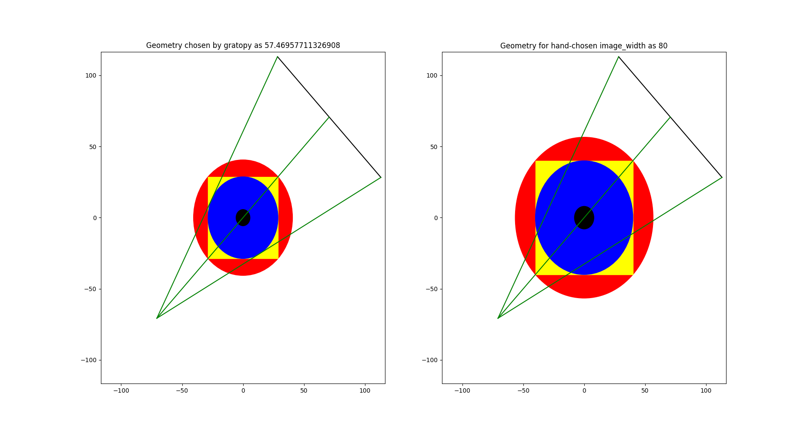

Getting Started
****************

Basic principle of gratopy 
===============================

The cornerstone of the gratopy toolbox is formed by the :py:class:`gratopy.ProjectionSettings` class, which defines the geometry to consider, and collects all relevant 
information to create the kernels and precomputes and saves
relevant quantities. Thus, virtually all functions of gratopy require an object of this class. 
In particular, gratopy offers implementation for two different geometric settings, the parallel beam and the fanbeam setting. 

The main functions of gratopy are  :class:`gratopy.forwardprojection` and :class:`gratopy.backprojection`, which allow to project 
an image **img** onto an sinogram **sino** and backproject **sino** onto **img**.

An image of the investigated object are represented in gratopy by `pyopencl.Array  <https://documen.tician.de/pyopencl/array.html>`_ **img** of dimensions :math:`(N_x,N_y)` grid  
-- or :math:`(N_x,N_y,N_z)` for multiple slices -- representing a rectangular grid of equi-distant quadratic pixels,
where the saved values correspond to the average mass inside the pixel. We think of the investigated object as being a circular and contained in the corresponding image-rectangle.  
When using an image together with projectionsetting -- an instance of :class:`ProjectionSettings` --  the xy-shape has to coincide with the attribute **img_shape** of projectionsetting, we say they need to be **compatible**. The values dtype
of this array must be numpy.dtype(float32) or numpy.dtype(float), i.e., single or double precision, and can have either C or F contiguity. 
 

Similarly, a sinogram  is represented by a :class:`pyopencl.Array`  **sino** of the form :math:`(N_s,N_a)` or :math:`(N_s,N_a,N_z)` for :math:`N_s` the number of detecotors and :math:`N_a` the number of angles, 
where for the parallel beam setting the angular range :math:`[0,\pi[` is considered. These dimensions must be **compatible** 
with the  projectionsetting of the class :class:`ProjectionSettings`  used together with, i.e., :math:`(N_s,N_a)` coincides with **sinogram_shape** attribute of projectionsetting. 
The width of the detector is given by the attribute **detector_width** of projectionsetting, and the detector pixels are equidistantly partioning the detectorline with width 
:math:`\delta_s`. The angles on the other hand need not be equi-distant or even partion the entire angular domain. The values associated to pixels in the sinogram again correspond to the average
intensity values of a continuous sinogram counterpart. The values dtype of this array must be numpy.dtype(float32) or numpy.dtype(float), i.e., single or double precision, and can have either C or F contiguity.
 
For the Radon transform the geometry is mainly determined by the ratio of image_width to detector_width, for most standard examples these parameters coincide. 
Note that rescaling the geometry creates operators which are also rescaled versions of the original ones.

The considerations concerning **img** and **sino** remain valid for the fanbeam transform. However the geometry gets slightly more complex, as the distance from source to the center of rotation denoted
by **RE** and the distance from the source to the detector denoted by **R**. The angular range for the Fanbeam transform is given as a subset of :math:`[0,2\pi[`.

Standardly it is assumed that the given angles completely partition the angular range, which has implications for the backprojection. In case this is not desired, and rather a limited angle situation
is considered, see fullangle parameter of :py:class:`gratopy.ProjectionSettings`.

.. image:: grafics/Radon-1.png
    :width: 5000
    :alt: Depiction of parallel beam geometry
Geometry of the parallel beam setting.

	
.. image:: grafics/Fanbeam-1.png
	:alt: Depiction of fan beam geometry

Geometry of the fanbeam setting.

First example: Radon transform
===============================

One can start in Python via
::
    #Initial import and definitions
    from numpy import *
    import pyopencl as cl
    import gratopy
    import matplotlib .pyplot as plt
    number_angles=60
    number_detector=300
    Nx=300

    #create pyopencl context
    ctx = cl.create_some_context()
    queue = cl.CommandQueue(ctx)
	
    #create phantom as testimage
    phantom=gratopy.phantom(queue,Nx)
	
    #create suitable ProjectionSettings
    PS=gratopy.ProjectionSettings(queue,gratopy.RADON,phantom.shape
        ,number_angles,number_detector)
		
    #Compute forward projection and backprojection of created sinogram	
    sino=gratopy.forwardprojection(phantom,PS)
    backproj=gratopy.backprojection(sino,PS)

    #Plot results
    plt.figure()
    plt.title("Generated Phantom")
    plt.imshow(phantom.get(),cmap="gray")
    
    plt.figure()
    plt.title("Sinogram")
    plt.imshow(sino.get(),cmap="gray")

    plt.figure()
    plt.title("Backprojection")
    plt.imshow(backproj.get(),cmap="gray")
    plt.show()

The following depcits the plots created by the example 1.

.. image:: grafics/Phantom.png

.. image:: grafics/Sinogram.png

.. image:: grafics/Backprojection.png

Second example: Fanbeam transform
=================================
As a second example, we consider the fanbeam geometry, which has a detector that is 120 cm wide, the distance from the source to the center of rotation is 100 cm
while and the distance from source to detector are 200 cm. Via the :class:`gratopy.show_geometry` method of the :class:`gratopy.ProjectionSettings` to visualize the defined geometry.
::
    #Initial import and definitions
    from numpy import *
    import pyopencl as cl
    import gratopy
    import matplotlib .pyplot as plt
    number_angles=60
    number_detector=300
    image_shape=(500,500)
    Nx=300
	
    #create pyopencl context
    ctx = cl.create_some_context()
    queue = cl.CommandQueue(ctx)

    #Additional parameter
    my_detector_width=120
    my_R=200
    my_RE=100
	
	#Fanbeam setting with automatic image_width
    PS1=gratopy.ProjectionSettings(queue,gratopy.FANBEAM,
        img_shape=image_shape
        ,angles=number_angles,n_detectors=number_detector, 
        detector_width=my_detector_width,R=my_R,RE=my_RE)
    
    print("image_width chose by gratopy", PS1.image_width)

    #Fanbeam setting with set image_width
    my_image_width=80    
    PS2=gratopy.ProjectionSettings(queue,gratopy.FANBEAM,
        img_shape=image_shape
        ,angles=number_angles,n_detectors=number_detector, 
        detector_width=my_detector_width,R=my_R,RE=my_RE,
        image_width=my_image_width)

   
    #Plot geometries associated to these projectionsettings
    fig,(axes1,axes2) =plt.subplots(1,2)
    PS1.show_geometry(pi/4,figure=fig,axes=axes1,show=False)
    PS2.show_geometry(pi/4,figure=fig,axes=axes2,show=False)
    axes1.set_title("Geometry chosen by gratopy as "
        +str(PS1.image_width))
    axes2.set_title("Geometry for hand-chosen image_width as "
        +str(my_image_width))
    plt.show()
    
Once the geometry has been defined via the projectionsetting, forward and backprojections can be used just as for the Radon transform in example 1.
Note that the automatism of gratopy chooses image_width=57.46 cm. When looking at the corresponding plot via show_geometry, the image_width is such that the entirety of an object inside 
the blue circle (with diameter 57.46) is exactly captured by each projection, and thus the area represented by the image corresponds to the yellow rectangle and blue circle, the smallest rectangle to capture the entire object. On the other hand, the outer red circle illustrates the diameter of an object wholy containing the image.

Further examples can be found in the test files in the `tests` folder inside gratopy, showing multiple examples and possible uses for the gratopy toolbox. 

Plot from show_geometry for fanbeam setting with automatic and handchosen image_width.

