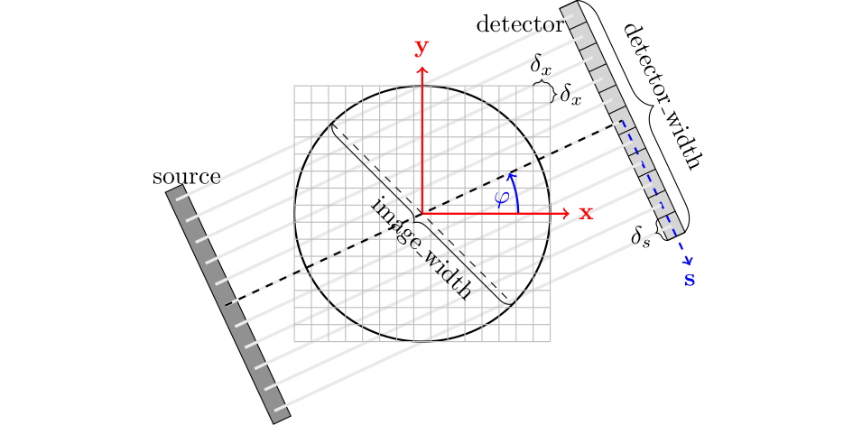
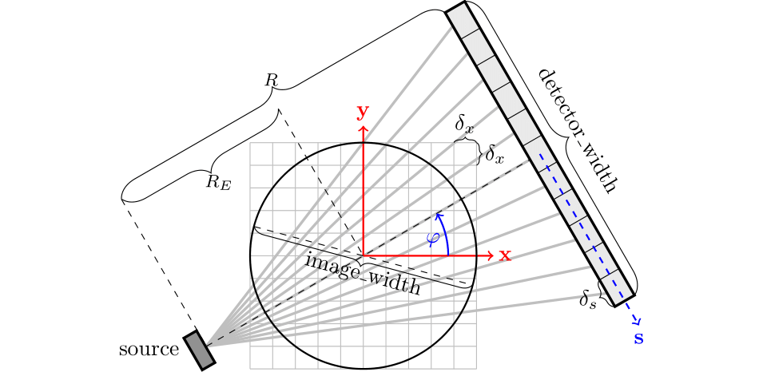
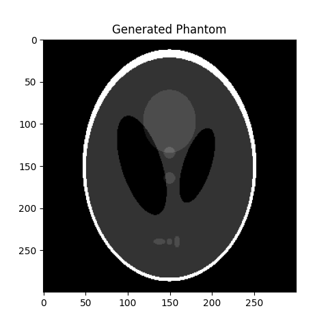
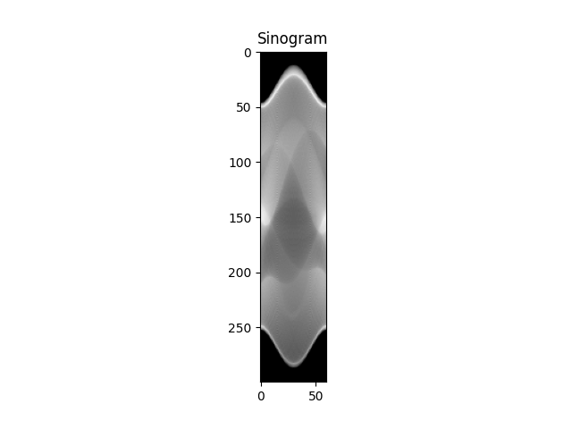
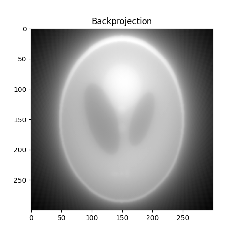
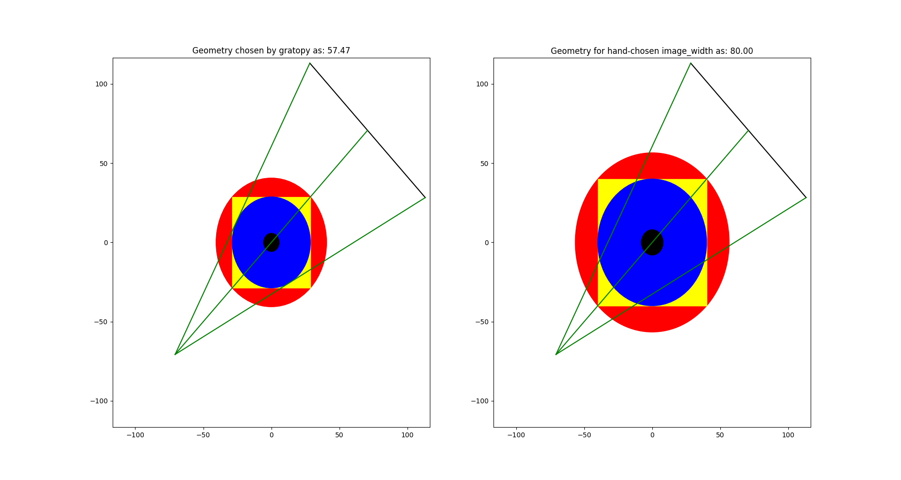

.. _getting-started:

Getting started
===============

Basic principles of gratopy
---------------------------

We start by explaining some recurring relevant quantities and concepts in gratopy, in particular the :class:`ProjectionSettings <gratopy.ProjectionSettings>`
class as well as the use of images and sinograms and the connection of forward projection to backprojection in the context of gratopy.

ProjectionSettings
''''''''''''''''''

The cornerstone of the gratopy toolbox is formed by the :py:class:`gratopy.ProjectionSettings` class, which defines the considered geometry, collects all relevant
information to create the OpenCL kernels, and precomputes and saves
relevant quantities. Thus, virtually all functions of gratopy require an object of this class, usually referred to as **projectionsetting**.
In particular, gratopy offers the implementation for two different geometric settings, the **parallel beam** and the **fanbeam** setting.

The geometry of the **parallel beam setting** is mainly defined by the **image_width** -- the physical diameter of the object in question in arbitrary units, e.g., 3 corresponding to 3cm (or m, etc.) -- and the **detector_width** -- the physical width of the detector in the same unit --,
both parameters of a **projectionsetting**. For most standard examples for the Radon transform, these parameters coincide, i.e., the detector is exactly as wide as the diameter of the imaged object, and thus, captures all rays passing through the object.

The **fanbeam setting** additionally requires **RE** -- the physical distance from the source to the center of rotation --
and **R** -- the physical distance from the source to the detector -- to define
the geometry, see the figures below.

Moreover, the projection requires discretization parameters, i.e., the shape of the image to project and the number of detector pixels to map to. Note that these transforms are scaling-invariant in the sense that
rescaling all *physical* quantities by the same factor creates operators which are rescaled versions of the original ones. On the other hand, changing the number of pixels of the image or the detector leaves the
physical system unchanged and simply reflects a finer/coarser discretization.

The angular range for the parallel beam setting is :math:`[0,\pi[`, while for the fanbeam setting, it is :math:`[0,2\pi[`.
By default, it is assumed that the given angles completely partition the angular range.
In case this is not desired, a limited-angle situation
can be considered by adapting the **angles** and **angle_weights** parameters of :py:class:`gratopy.ProjectionSettings`, impacting, for instance, the backprojection operator.
Note also that the projections considered are rotation-invariant in the sense, that projection of a rotated image yields a sinogram which is translated in the angular dimension.

Note that the angles are measured (counterclockwise) from the positive *x* axis and reflect the projection-direction. The positive detector-direction is the clockwise
rotation of the projection-direction by :math:`\frac \pi 2`.

Geometry of the parallel beam setting.

Geometry of the fanbeam setting.

The main functions of gratopy are  :func:`forwardprojection <gratopy.forwardprojection>` and :func:`backprojection <gratopy.backprojection>`, which use a **projectionsetting** as the basis for computation and allow to project
an image **img** onto a sinogram **sino** and to backproject **sino** onto **img**, respectively. Next, we describe how to use and interpret images and sinograms in gratopy.

.. _compatible:

Images in gratopy
'''''''''''''''''

An image **img** is represented in gratopy by a :class:`pyopencl.array.Array` of dimensions :math:`(N_x,N_y)`
-- or :math:`(N_x,N_y,N_z)` for multiple slices -- representing a rectangular grid of equidistant quadratic pixels of size :math:`\delta_x=\mathrm{image\_width}/\max\{N_x,N_y\}`,
where the associated values correspond to the average mass inside the area covered by each pixel. The area covered by the pixels is called the image domain, and the image array
can be associated with a piecewise constant function on the image domain. Usually, we think of the investigated object as being circular and contained in
the rectangular image domain. More generally, **image_width** corresponds to the larger side length of a rectangular :math:`(N_x,N_y)` grid of quadratic image pixels
which allows considering *slim* objects.
The image domain is, however, always a rectangle or square
that is aligned with the *x* and *y* axis.
When using an image together with **projectionsetting** -- an instance of :class:`gratopy.ProjectionSettings` --  the values :math:`(N_x,N_y)` have to coincide with the attribute **img_shape** of **projectionsetting**, we say they need to be **compatible**. The data type
of this array must be :attr:`numpy.float32` or :attr:`numpy.float64`, i.e., single or double precision, and can have either *C* or *F* contiguity_.

.. _contiguity: https://documen.tician.de/pyopencl/array.html#pyopencl.array.Array

Note that in gratopy, the first and second axis of an image array corresponds to the *x* and *y* axis, respectively, 
as depicted in the figures above.

.. _compatible-sino:

Sinograms in gratopy
''''''''''''''''''''

Similarly, a sinogram  **sino** is represented by a :class:`pyopencl.array.Array`  of the shape :math:`(N_s,N_a)` or :math:`(N_s,N_a,N_z)` for :math:`N_s` being the number of detectors and :math:`N_a` being the number of angles for which projections are considered.
When used together with a **projectionsetting** of class :class:`gratopy.ProjectionSettings`, these dimensions must be **compatible**, i.e., :math:`(N_s,N_a)` has to coincide with the  **sinogram_shape** attribute of **projectionsetting**.
The width of the detector is given by the attribute **detector_width** of **projectionsetting** and the detector pixels are equidistantly partitioning the detector line with detector pixel width
:math:`\delta_s=\mathrm{detector\_width}/N_s`. The angles, on the other hand, do not need to be equidistant or even partition the entire angular range; gratopy allows for rather general angle sets. The values associated with pixels in the sinogram again correspond to the average
intensity values of a continuous sinogram counterpart and thus can be associated with a piecewise constant function. The data type of this array must be :attr:`numpy.float32` or :attr:`numpy.float64`, i.e., single or double precision, and can have either *C* or *F* contiguity_.

.. _adjointness:

Adjointness in gratopy
''''''''''''''''''''''

Gratopy allows a great variety of geometric setups for the forward
projection and the backprojection. One particular feature is
that forward projection and backprojection are adjoint operators,
which is important, for instance, in the
context of optimization algorithms. Here, adjointness is achieved
with respect to natural scalar products in image and sinogram Hilbert space
that we wish to clarify in the following.
As described above, the discrete values in an image array are associated
with values of piecewise constant functions inside square pixels
(of area :math:`\delta_x^2`) in the image domain.
For such piecewise constant functions, the classical :math:`L^2` scalar product
is considered, which results in :math:`\langle \text{img1}, \text{img2} \rangle = \delta_x^2 \sum_{x,y} \text{img1}_{x,y} \text{img2}_{x,y}`
for image arrays **img1** and **img2**.
Similarly, the discrete values of the sinogram are associated with a piecewise
constant function on the Cartesian product of an interval of length
**detector_width** and the angular domain. Correspondingly, the natural inner product for the sinogram space is given by
:math:`\langle \text{sino1}, \text{sino2} \rangle = \delta_s \sum_{s,a} \Delta_a \text{sino1}_{s,a} \text{sino2}_{s,a}`, where :math:`\Delta_a`
denotes the length of the angular range covered (in the sense of piecewise constant discretization)
by the a-*th* angle (by default, all :math:`\Delta_a` are determined automatically based on the **angles** parameter, for more information on **angle_weights**, see :class:`gratopy.ProjectionSettings`).
Hence, the implementations of the forward and backprojection in gratopy are to be understood in this
context, and in particular, the forward projection and backprojection operator are adjoint
with respect to these scalar products, as can be observed in :func:`tests.test_radon.test_adjointness()` and :func:`tests.test_fanbeam.test_adjointness()`.

Though this is, in a sense, the natural discretization and sense of adjointness, it might be
of interest to consider adjointness in a different sense. In this respect,
gratopy allows to alter the sinogram space by manually
setting the angle weights :math:`(\Delta_a)_a`
to desired values, which changes the weights in the backprojection,
but always leads to an adjoint operator in the sense of the aforementioned
scalar products.

For example, all angles can be weighted equally with 1 in a sparse angle
setting. When setting **angle_weights**  :math:`\Delta_a=\frac {\delta_x^2}{\delta_s}`,
the operators are adjoint with respect to the standard scalar products
:math:`\langle \text{img1}, \text{img2} \rangle = \sum_{x,y}\text{img1}_{x,y}\text{img2}_{x,y}`
and :math:`\langle \text{sino1}, \text{sino2} \rangle = \sum_{s,a} \text{sino1}_{s,a}\text{sino2}_{s,a}`.

First example: Radon transform
------------------------------

One can start in Python via the following simple code which computes the forward
and backprojection of a phantom:
::

    # initial import
    import numpy as np
    import pyopencl as cl
    import matplotlib.pyplot as plt

    import gratopy

    # discretization parameters
    number_angles = 60
    number_detectors = 300
    Nx = 300
    # Alternatively to number_angles one could give as angle input
    # angles = np.linspace(0, np.pi, number_angles+1)[:-1]

    # create pyopencl context
    ctx = cl.create_some_context()
    queue = cl.CommandQueue(ctx)

    # create phantom as test image (a pyopencl.array.Array of dimensions (Nx, Nx))
    phantom = gratopy.phantom(queue,Nx)

    # create suitable projectionsettings
    PS = gratopy.ProjectionSettings(queue, gratopy.RADON, phantom.shape,
                                    number_angles, number_detectors)

    # compute forward projection and backprojection of created sinogram
    # results are pyopencl arrays
    sino = gratopy.forwardprojection(phantom, PS)
    backproj = gratopy.backprojection(sino, PS)

    # plot results
    plt.figure()
    plt.title("Generated Phantom")
    plt.imshow(phantom.get(), cmap="gray")

    plt.figure()
    plt.title("Sinogram")
    plt.imshow(sino.get(), cmap="gray")

    plt.figure()
    plt.title("Backprojection")
    plt.imshow(backproj.get(), cmap="gray")
    plt.show()

The following depicts the plots created by this example.

Second example: Fanbeam transform
---------------------------------

As a second example, we consider a fanbeam geometry that has a detector that is 120 (cm) wide, the distance from the the source to the center of rotation is 100 (cm),
while the distance from the source to the detector is 200 (cm). We do not choose the **image_width** but rather let gratopy automatically determine a suitable **image_width**. We visualize the defined geometry via the :class:`gratopy.ProjectionSettings.show_geometry` method.
::

    # initial import
    import numpy as np
    import pyopencl as cl
    import matplotlib .pyplot as plt

    import gratopy

    # discretization parameters
    number_angles = 60
    number_detectors = 300
    image_shape = (500, 500)

    # create pyopencl context
    ctx = cl.create_some_context()
    queue = cl.CommandQueue(ctx)

    # physical parameters
    my_detector_width = 120
    my_R = 200
    my_RE = 100

    # fanbeam setting with automatic image_width
    PS1 = gratopy.ProjectionSettings(queue, gratopy.FANBEAM,
                                     img_shape=image_shape,
                                     angles=number_angles,
                                     n_detectors=number_detectors,
                                     detector_width=my_detector_width,
                                     R=my_R, RE=my_RE)

    print("image_width chosen by gratopy: {:.2f}".format((PS1.image_width)))

    # fanbeam setting with set image_width
    my_image_width = 80.0
    PS2 = gratopy.ProjectionSettings(queue, gratopy.FANBEAM,
                                     img_shape=image_shape,
                                     angles=number_angles,
                                     n_detectors=number_detectors,
                                     detector_width=my_detector_width,
                                     R=my_R, RE=my_RE,
                                     image_width=my_image_width)

    # plot geometries associated to these projectionsettings
    fig, (axes1, axes2) = plt.subplots(1,2)
    PS1.show_geometry(np.pi/4, figure=fig, axes=axes1, show=False)
    PS2.show_geometry(np.pi/4, figure=fig, axes=axes2, show=False)
    axes1.set_title("Geometry chosen by gratopy as: {:.2f}".format((PS1.image_width)))
    axes2.set_title("Geometry for manually-chosen image_width as: {:.2f}"
                    .format((my_image_width)))
    plt.show()

Once the geometry has been defined via the **projectionsetting**, forward and backprojections can be used just like for the Radon transform in the first example.
Note that the automatism of gratopy chooses **image_width** = 57.46 (cm). When looking at the corresponding plot via :class:`gratopy.ProjectionSettings.show_geometry`, the **image_width** is such that the entirety of an object inside
the blue circle (with diameter 57.46) is exactly captured by each projection, and thus, the area represented by the image corresponds to the yellow rectangle and blue circle which is the smallest rectangle to capture the entire object. On the other hand, the outer red circle illustrates the diameter of the smallest circular object entirely containing the image.

Plot produced by :class:`gratopy.ProjectionSettings.show_geometry` for the fanbeam setting with automatic and manually chosen **image_width**, both for projection from 45°.

Further examples can be found in the source files of the :ref:`test-examples`.
