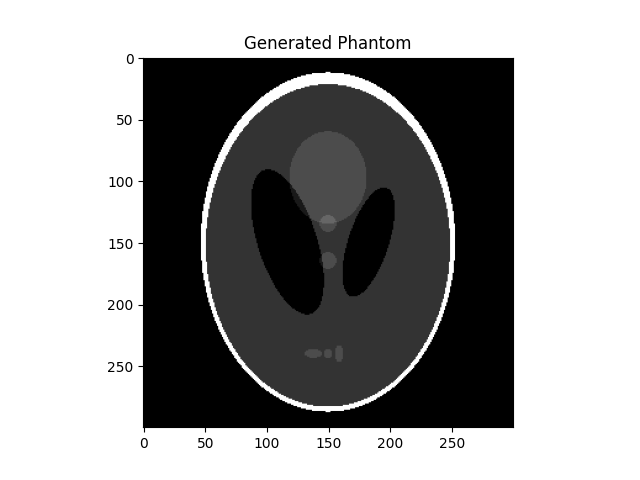

Getting Started
****************

Basic principles of gratopy 
============================

We start by explaining some recurring relevant quantities and concepts in gratopy, in particular the :class:`ProjectionSettings` class as well as the use of images and sinograms in the context of gratopy.

ProjectionSettings
-------------------

The cornerstone of the gratopy toolbox is formed by the :py:class:`gratopy.ProjectionSettings` class, which defines the considered geometry and collects all relevant 
information to create the kernels and precomputes and saves
relevant quantities. Thus, virtually all functions of gratopy require an object of this class, usually referred to as **projectionsetting**. 
In particular, gratopy offers implementation for two different geometric settings, the **parallel beam** and the **fanbeam** setting. 

The geometry of the parallel beam setting is mainly defined by the **image_width** -- the physical diameter of the object in question, e.g., 3 corresponding to 3cm (or m etc.) -- and **detector_width** -- the physical width of the detector --,
both parameters of a **projectionsetting**. For most standard examples of Radon transform these parameters coincide, i.e., the detector is exactly as long as the diameter of object and thus captures exactly all rays passing through the object. 

For the fanbeam setting additionally the physical distance from source to the center of rotation denoted by **RE** and the physical distance from the source to the detector denoted by **R** are necessary to define 
the geometry, see the figures below. 

Moreover the projection requires discretization parameters, i.e., the shape of the image to project from and number of detector pixels to map to. Note that these transforms are scaling-invariant,
meaning rescaling all *physical* quantities by the same factor creates operators which are rescaled versions of the original ones. On the other hand changing the number of pixels leaves the 
physical system intact and simply reflects a finer/coarser discretization.

The angular range for the parallel beam setting is :math:`[0,\pi[`, while for fanbeam it is :math:`[0,2\pi[`. 
By default it is assumed that the given angles completely partition the angular range. In case this is not desired  and a limited-angle situation
is considered, the **fullangle** parameter of :py:class:`gratopy.ProjectionSettings` can be adapted, which has implications, e.g.,
for the backprojection operator.

.. image:: graphics/radon-1.png
    :width: 5000
    :alt: Depiction of parallel beam geometry
    
Geometry of the parallel beam setting.

	
.. image:: graphics/ranbeam-1.png
    :width: 5000
    :alt: Depiction of fan beam geometry
    
Geometry of the fanbeam setting.

The main functions of gratopy are  :class:`gratopy.forwardprojection` and :class:`gratopy.backprojection`, which use a **projectionsetting** as the basis for computation and allow to project 
an image **img** onto an sinogram **sino** and to backproject **sino** onto **img**. Next, we describe the requirements for such images and sinograms, and how to interpret corresponding values.

 
Images in gratopy
-------------------

An image **img** is represented in gratopy by a `pyopencl.Array  <https://documen.tician.de/pyopencl/array.html>`_ object of dimensions :math:`(N_x,N_y)`   
-- or :math:`(N_x,N_y,N_z)` for multiple slices -- representing a rectangular grid of equi-distant quadratic pixels of size :math:`\delta_x=\text{image_width}/\max\{N_x,N_y\}`,
where the associated values correspond to the average mass inside the area covered by the pixel. Usually, we think of the investigated object as being circular and contained in the rectangular image domain of **img**. More generally, **image_width** corresponds to the larger side-length of an rectangular :math:`(N_x,N_y)` grid  of quadratic image pixels   which allow to consider *slim* objects -- 
though this might require a shift of the angles to ensure that the object is indeed contained in the image area.  
When using an image together with **projectionsetting** -- an instance of :class:`ProjectionSettings` --  the values :math:`(N_x,N_y)` have to coincide with the attribute **img_shape** of **projectionsetting**, we say they need to be **compatible**. The data type
of this array must be :class:`numpy.dtype(float32)` or :class:`numpy.dtype(float)`, i.e., single or double precision, and can have either C or F contiguity. 
 
Sinograms in gratopy
------------------------

Similarly, a sinogram  **sino** is represented by a :class:`pyopencl.Array`  of the shape :math:`(N_s,N_a)` or :math:`(N_s,N_a,N_z)` for :math:`N_s` being the number of detectors and :math:`N_a` being the number of angles for which projections are considered. 
When using together with a **projectionsetting** of class :class:`ProjectionSettings`, these dimensions must be **compatible**, i.e., :math:`(N_s,N_a)` has to coincide with the  **sinogram_shape** attribute of **projectionsetting**. 
The width of the detector is given by the attribute **detector_width** of **projectionsetting** and the detector pixels are equi-distantly partitioning the detector line with width 
:math:`\delta_s`. The angles on the other hand need not be equi-distant or even partition the entire angular range. The values associated with pixels in the sinogram again correspond to the average
intensity values of a continuous sinogram counterpart. The data type of this array must be :class:`numpy.dtype(float32)` or :class:`numpy.dtype(float)`, i.e., single or double precision, and can have either C or F contiguity.
 

First example: Radon transform
===============================

One can start in Python via
::

    #Initial import
    from numpy import *
    import pyopencl as cl
    import gratopy
    import matplotlib.pyplot as plt
    
    #Discretization parameter
    number_angles=60
    number_detector=300
    Nx=300

    #create pyopencl context
    ctx = cl.create_some_context()
    queue = cl.CommandQueue(ctx)
	
    #create phantom as testimage (is a pyopencl.Array of dimensions (Nx,Nx))
    phantom=gratopy.phantom(queue,Nx)
	
    #create suitable ProjectionSettings
    PS=gratopy.ProjectionSettings(queue,gratopy.RADON,phantom.shape,
                                  number_angles,number_detector)
		
    #Compute forward projection and backprojection of created sinogram
    #results are pyopencl arrays	
    sino=gratopy.forwardprojection(phantom,PS)
    backproj=gratopy.backprojection(sino,PS)

    #Plot results
    plt.figure()
    plt.title("Generated Phantom")
    plt.imshow(phantom.get(),cmap="gray")
    
    plt.figure()
    plt.title("Sinogram")
    plt.imshow(sino.get(),cmap="gray")

    plt.figure()
    plt.title("Backprojection")
    plt.imshow(backproj.get(),cmap="gray")
    plt.show()

The following depicts the plots created by the example 1.

.. image:: graphics/Sinogram.png
    :width: 5000
    
.. image:: graphics/Backprojection.png
    :width: 5000

Second example: Fanbeam transform
=================================
As a second example, we consider the fanbeam geometry, which has a detector that is 120 (cm) wide, the distance from the source to the center of rotation is 100 (cm)
while and the distance from source to detector are 200 (cm). We do not choose the **image_width** but rather let gratopy automatically choose a suitable **image_width**. We visualize the defined geometry via the :class:`gratopy.show_geometry` method of  :class:`gratopy.ProjectionSettings`. 
::

    #Initial import
    from numpy import *
    import pyopencl as cl
    import gratopy
    import matplotlib .pyplot as plt
    
    #Discretization parameters
    number_angles=60
    number_detector=300
    image_shape=(500,500)
	
    #create pyopencl context
    ctx = cl.create_some_context()
    queue = cl.CommandQueue(ctx)

    #Physical parameters
    my_detector_width=120
    my_R=200
    my_RE=100
	
    #Fanbeam setting with automatic image_width
    PS1=gratopy.ProjectionSettings(queue,gratopy.FANBEAM,
			img_shape=image_shape,angles=number_angles,
			n_detectors=number_detector, 
                        detector_width=my_detector_width,R=my_R,RE=my_RE)
    
    print("image_width chose by gratopy{:.2f}".format((PS1.image_width)))

    #Fanbeam setting with set image_width
    my_image_width=80    
    PS2=gratopy.ProjectionSettings(queue,gratopy.FANBEAM,
        img_shape=image_shape
        ,angles=number_angles,n_detectors=number_detector, 
        detector_width=my_detector_width,R=my_R,RE=my_RE,
        image_width=my_image_width)

    #Plot geometries associated to these projectionsettings
    fig,(axes1,axes2) =plt.subplots(1,2)
    PS1.show_geometry(pi/4,figure=fig,axes=axes1,show=False)
    PS2.show_geometry(pi/4,figure=fig,axes=axes2,show=False)
    axes1.set_title("Geometry chosen by gratopy as: {:.2f}".format((PS1.image_width)))
    axes2.set_title("Geometry for hand-chosen image_width as: {:.2f}".format((my_image_width)))
    plt.show()
    
Once the geometry has been defined via the **projectionsetting**, forward and backprojections can be used just as for the Radon transform in Example 1.
Note that the automatism of gratopy chooses **image_width** =57.46 (cm). When looking at the corresponding plot via :class:`show_geometry`, the **image_width** is such that the entirety of an object inside 
the blue circle (with diameter 57.46) is exactly captured by each projection, and thus, the area represented by the image corresponds to the yellow rectangle and blue circle which is the smallest rectangle to capture the entire object. On the other hand, the outer red circle illustrates the diameter of the largest object entirely containing the image.

Further examples are found in the source files of `test files <test_examples.html>`_. 

.. image:: graphics/figure-1.png
    :width: 5000
    :align: center

Plot from show_geometry for fanbeam setting with automatic and manually chosen **image_width**.

